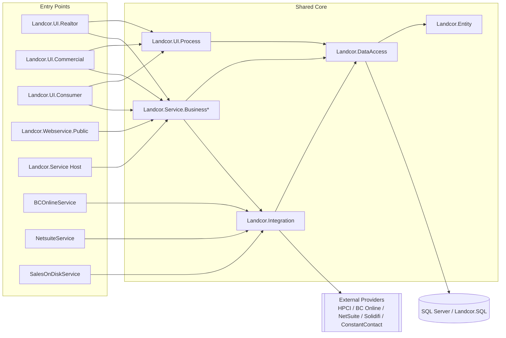

# PR1.03 — Dependency Diagrams

This document provides a textual and mermaid view of current-state dependencies and proposed near-term target structure.

## Current-state dependency map (high-level)



## Target dependency map (modular monolith on .NET 8)

```mermaid
flowchart LR
  subgraph Host[WeAppraise Host (.NET 8)]
    API[HTTP API / UI BFF]
    MOD1[Identity & Access Module]
    MOD2[Property & Valuation Module]
    MOD3[Order & Cart Module]
    MOD4[Reporting Module]
    MOD5[Integrations Module]
    MOD6[Admin & Ops Module]
  end

  API --> MOD1
  API --> MOD2
  API --> MOD3
  API --> MOD4
  API --> MOD6

  MOD3 --> MOD5
  MOD4 --> MOD5
  MOD6 --> MOD5

  subgraph Data[Data]
    SQL[(Azure SQL)]
    RM[(Read Models / Projections)]
  end

  MOD1 --> SQL
  MOD2 --> SQL
  MOD3 --> SQL
  MOD4 --> SQL
  MOD6 --> SQL
  MOD2 --> RM
  MOD3 --> RM

  MOD5 --> BUS[(Service Bus)]
  MOD5 --> EXT2[[External Providers]]
```

## Diagram notes

- Current state shows many entry points sharing the same business/data libraries.
- Target state preserves one deployable first but enforces module interfaces and clearer dependency rules.
- Target state assumes **internal module contracts** for cross-module calls and **outbox → Service Bus → worker** for integration fan-out, which is why Integrations is the only provider-facing module.
